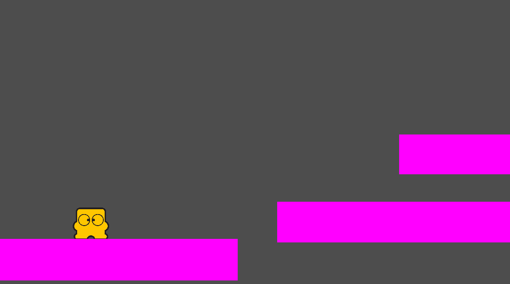

# Platformer Prototypes
Various prototypes for 2D platformers, including:

## Fishdrop
Fast-paced 2D platformer focused on momentum and simple controls (just one action button!).

### Controls
- ARROW KEYS to MOVE
- Hold SPACE while grounded to CROUCH
- Hold SPACE while grounded and MOVING to SLIDE
- While CROUCHING/SLIDING, let go of SPACE to JUMP
- Hold SPACE while airborne to drop down

## Dash Counter
Even faster-paced 2D platformer, this time with a horizontal DASH.

### Controls
- WASD to MOVE
- Press J while grounded to JUMP
- Press J while in air to DOUBLE JUMP
- Press K to DASH (vertical momentum is conserved after DASH)
- Hold direction into wall to WALL SLIDE
- Press J while WALL SLIDING to WALL JUMP (gives horizontal momentum away from wall)

### Running
Download and run the Mac binary `dash_counter.app`.

Probably also possible to open the project in the Unity Editor and build from there.
